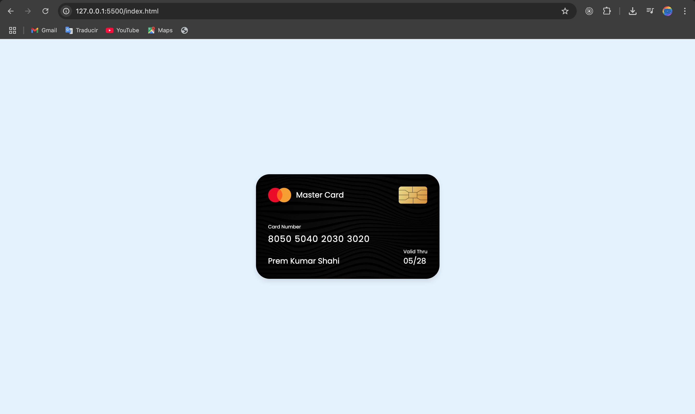

##  Credit Card UI

> This is a credit card made with HTML, CSS and some pngs.




## 🔧 Built With

- HTML
- CSS

## Getting Started

To get a local copy up and running follow these simple example steps.

- Go to the main page of te repo.
- Press the ```Code``` button and get the repo link.
- Clone it using git.

## Authors

**Cecilia Benitez**

- [@Ceci007](https://github.com/Ceci007)


## Contributing

Contributions, issues and feature requests are welcome!

Feel free to check the [issues page](https://github.com/Ceci007/credit-card-ui/issues).

## 📝 License

This project is [FIUNA](https://www.ing.una.py/FIUNA3/) licensed.